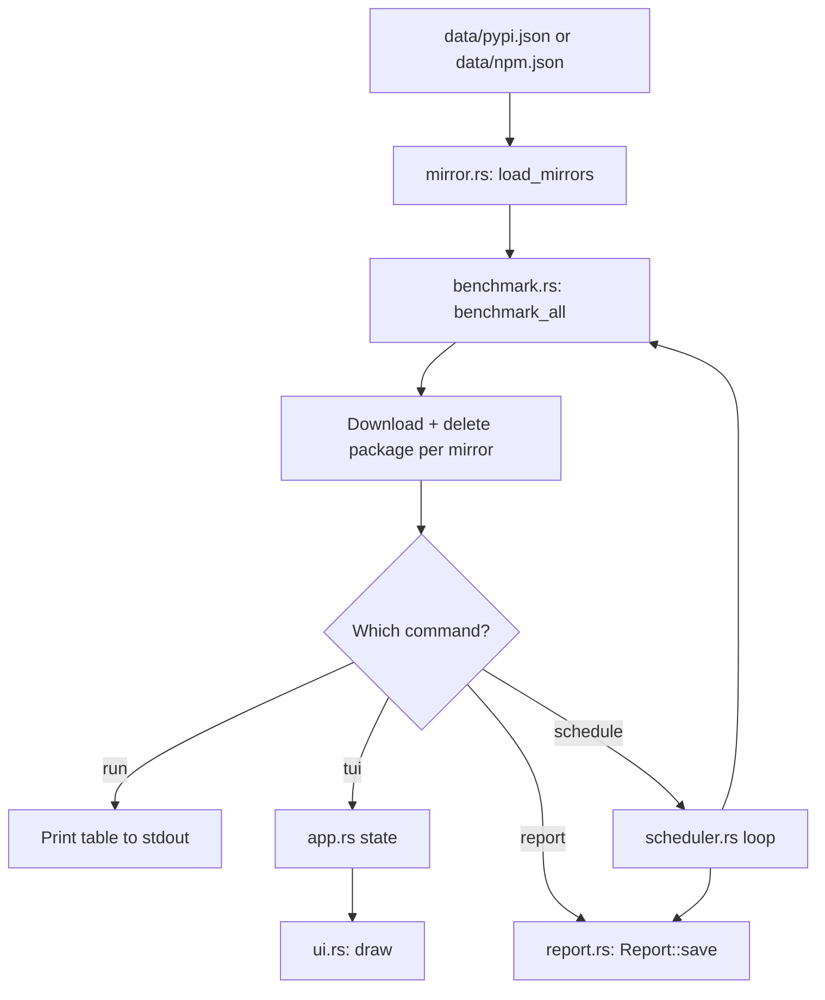

# Architecture

## Modules

| Module          | Responsibility                                              |
|------------------|--------------------------------------------------------------|
| `main.rs`        | CLI parsing (`clap`) and dispatch to subcommands             |
| `app.rs`         | TUI application state (selection, results, status)           |
| `ui.rs`          | Renders the TUI with `ratatui`                                |
| `benchmark.rs`   | Downloads a real package from each mirror and measures latency |
| `mirror.rs`      | Loads the sample package name + mirror URL list from `data/*.json` |
| `report.rs`      | Builds and saves JSON reports to `reports/`                   |
| `scheduler.rs`   | Infinite benchmark/report/sleep loop                          |

## Data Flow

`load_mirrors` returns a `MirrorConfig { package, mirrors }` loaded from
the package manager's JSON file, so every downstream consumer knows both
which mirrors to test and which package to actually download from them.

## Benchmark Process

Benchmarking downloads a real package file from each mirror (never
installing it) so latency reflects an actual `pip install` / `npm install`
workflow rather than a bare HTTP ping.

For each mirror URL:

1. Build a `reqwest::Client` with a 15-second timeout.
2. Run 3 attempts, one at a time. Each attempt:
   1. Resolves the package's direct download URL on that mirror:
      - **PyPI**: fetches the PEP 503 "simple" index page
        (`{mirror}{package}/`) and extracts the first `href` pointing at
        a `.whl`/`.tar.gz`/`.zip`/`.egg` archive, resolving relative URLs
        against the index page.
      - **npm**: fetches the registry's `{mirror}{package}/latest`
        shortcut and reads `dist.tarball` from the returned JSON.
   2. Downloads the resolved file's full bytes.
   3. Writes the bytes to a uniquely-named file in the OS temp directory,
      then immediately deletes it.
   4. Records elapsed time via `Instant`, covering the resolve + download
      + delete round trip.
3. Average the latency across successful attempts.
4. If all 3 attempts fail (timeout, DNS error, connection refused, no
   archive found, malformed metadata), the mirror is marked
   `timed_out = true` with `success_rate = 0`.
5. Results are sorted by latency ascending, with timed-out mirrors sorted
   last regardless of latency value.

A single mirror failure never aborts the run — each mirror is benchmarked
independently and errors are captured into the result struct rather than
propagated.

Note: if a mirror's index/metadata doesn't rewrite package URLs to itself,
the actual file download may hit the origin host rather than the mirror's
own CDN. This mirrors real package-manager behavior against that mirror,
but is worth keeping in mind when interpreting results for mirrors that
only proxy metadata.

## Report Generation

`report.rs` converts a `Vec<BenchmarkResult>` into a `Report` struct
containing the package manager name, an RFC 3339 timestamp, per-mirror
entries, and the fastest reachable mirror. The report is serialized with
`serde_json` and written to `reports/YYYY-MM-DD_HH-MM.json`, creating the
`reports/` directory if it doesn't exist.

## Scheduler

`scheduler.rs` runs an infinite loop: for each package manager (pypi, then
npm), load mirrors, benchmark, and save a report. After both have run, it
sleeps for one hour (`tokio::time::sleep`) and repeats. There is no cron
integration or daemonization — the process must stay running in the
foreground (or under a process manager of the user's choosing).
